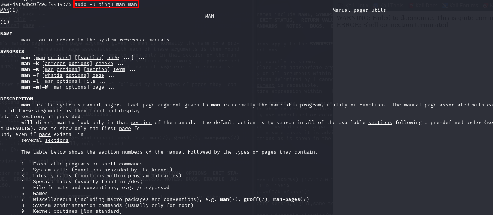
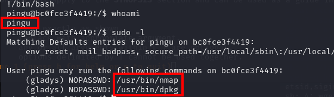

# Anonymous penguin

As always, the first steps will involve preparing the lab and performing a quick exploration using nmap to check which ports are open. In this case, ports 80 and 21 are open. 

Next, we'll attempt to access the web in search of anything of interest. 

Unfortunately, the website doesn't offer much to extract, so let's try conducting directory enumeration with gobuster to gather more information. 

One of the results is a directory named "upload," which might allow us to upload files or access others from there, potentially enabling a reverse shell. 
For now, let's return to the FTP on port 21 and attempt to access it anonymously. 

One of the directories in the FTP is named "upload," just like what we found with gobuster. 
Let's try sending a simple PHP file to verify if we can access it. 

Indeed, the name is displayed on the screen, indicating that we're likely able to establish a reverse shell. We can use the web shell generator to deploy any of its scripts. 

We upload the file and successfully establish a connection, obtaining our reverse shell. 
The user we access with is www-data, which can execute the command /usr/bin/man as the user pingu without requiring a password (NOPASSWD). 

The issue is that to escalate privileges, we need an interactive shell that allows us to abort and return to the shell with penguin's permissions. 

We tried several methods, but we can't even install socat, the commands seem not to work, and the Python console doesn't allow us to interrupt the man to return to the shell. 

I was about to give up when I finally managed to get the interactive shell. 
First, we'll execute the command script /dev/null -c bash to start a new bash session and save the output to /dev/null. 
Then, we suspend the session with Ctrl + Z and subsequently set the tty to stty raw -echo to transmit characters directly without processing and without echo. 
We resume the suspended session with fg. Next, we reset the terminal with reset xterm to ensure it's in a clean and usable state. 

Subsequently, we adjust the terminal size with stty rows 62 columns 248 to match the dimensions of our machine's screen, and finally, we set the environment variables TERM and SHELL with export TERM=xterm and export SHELL=bash, respectively, to ensure proper interaction with the terminal. 
With this setup, we can finally execute the privilege escalation. 

We perform the privilege escalation obtained from gtfobins and finally we manage to gain access as pingu.

Its time to  check the response provided by sudo -l for pingu so we can check his sudo privileges.

None of the options for privilege escalation work correctly with nmap, so we try with dpkg. 

With dpkg, we manage to access as gladys (sudo dpkg -l !/bin/sh). 

Finally, gladys can execute the chown command without a password and as root. 
What can we do with chown as admin? Grant permissions to own file such as /etc/passwd. 

Let's take a look at the passwd file to find out the UID and GID of the root user, which are both 0. We'll create a new user with these data. Since nano isn't recognized, we'll simply use echo to append to the end of the file. 

Now we can check that the user was successfully added. Time to access as this user with the password. 
Having both root and gari the same UID (User Identifier) and GID (Group Identifier) essentially grants complete control over the system. They can perform any action, modify any file, and access any data, regardless of ownership permissions. 

