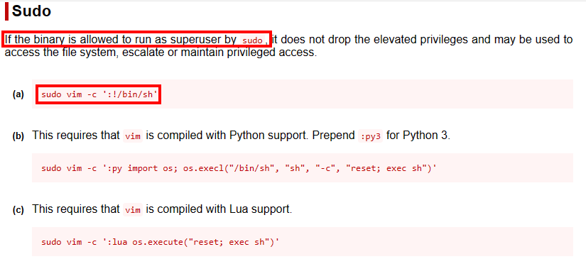

# Dockerlabs Trust

## Lab configuration:

First we extract the downloaded zip file, after that we get two files, the image of the machine and a script for its deployment.

Always before launching a script look at its content, never execute with sudo files that you do not know how it works.

This bash script automates the deployment and removal of a vulnerable machine environment in Docker. It defines functions to stop and remove containers and handle the SIGINT (Ctrl+C) signal.

It then verifies the installation of Docker and the presence of a .tar file. Upon receiving the .tar file, it loads a Docker image and displays a container with SSH and Apache services enabled.

Finally, it displays the IP address of the container and remains in an infinite loop to keep the script running until the user interrupts it.

We launch the script and get the IP of the vulnerable machine.

 

Once the address is obtained the next step is to **confirm that we can reach the machine** by simple **ping**, after which we will start with port scanning and service enumeration using tools such as nmap.

## Network scan
The nmap command is used to perform network scans and gather information about hosts and devices connected to a network. In this specific case, the command performs a full scan of a target machine specified by the <IP address>.

**Arguments:**

- sC: This argument instructs Nmap to perform a service scan. This means that Nmap will attempt to identify which services are running on open ports on the target machine.

- sV: This argument instructs Nmap to attempt to identify the version of the services being detected. This can be useful to determine if a particular service has known vulnerabilities.

- oN: This argument instructs Nmap to save the scan results in a text file named scan_results.txt.
 
- <IP_address>: This argument specifies the IP address of the target machine you want to scan.

From this Nmap scan result, there are a few interesting things to note:

1. port 22 (SSH): The SSH service is open on port 22, and the specific version is OpenSSH 9.2p1 Debian 2+deb12u2. This provides information about the operating system and the version of the software being used.
2. Port 80 (HTTP): The HTTP service is open on port 80, and the specific version is Apache httpd 2.4.57 on a Debian system. The default Apache home page is shown as the web page title.

Seeing that we have port 80 open, let's try to access it through the browser.

We could query by cve for this specific version of apache and go from there, but let's first try to enumerate directories.

There are different ways to perform directory enumeration, let's show some examples.

**DIRB,GOBUSTER,WFUZZ**

These tools are a free and open source **web content scanner** used to find existing (and/or hidden) web objects. It basically works by launching a **dictionary based attack against a web server** and analyzing the responses, here are the outputs of these tools using different dictionaries to gather information.

In this first scan we found relevant information but not enough. Let's try again by adding the -x option.

The -x option in the Gobuster command specifies the file extensions (in this case we are querying for files with php, sh, py or txt extension) that Gobuster should look for in the listed directories.

A new interesting directory /secret.php appears.

When accessing it the message Hello **Mario.** This site can't be hacked.

I am going to do something that I am not used to do and that is to listen to the message, because at the moment I have something that is more interesting to me and that is the **name** Mario

If you remember, earlier in the port scan, we found that it was also running the **ssh service**, maybe Mario is a username that we can try to break the password either by brute force or **dictionary**.

To do this we are going to employ hydra with the command:

hydra -l mario -P /usr/share/wordlists/rockyou.txt -vssh://172.17.0.2

If we had more information we could try to generate the password dictionary ourselves or we could try with a user dictionary, but since this is a simple problem we are just going to run it for mario.

After the execution we successfully find the password of the user mario and with this we can finally access by ssh on the victim machine.

## Privilege Escalation
Once inside the system, your goal is to obtain higher privileges. This may involve looking for local vulnerabilities, such as inappropriate permissions, misconfigured services or vulnerabilities in installed programs.

Now comes the million dollar question, how do we manage to escalate privileges?

Well, the first thing we will do is to take a walk around the system, although the machine is not in ctf format, maybe we can see some interesting files.

Some interesting files are:

We are going to go and check if we can access some sensitive file like:

- /etc/passwd and /etc/shadow: these files contain information about system users and their encrypted passwords. Looking for users with elevated privileges or weak passwords could be useful for privilege escalation.
- /etc/sudoers: This file defines which users can execute commands with elevated privileges using sudo.
- SUID/SGID files: These are executable files that have the SUID or SGID bit set in their permissions. This means that when they are executed, they are executed with the permissions of the owner or group respectively.

For the shadow file we have no permissions so we cannot attempt to break the password hash.

We are going to use the command sudo -l,this command is used to list the sudo privileges that the current user has.

We see that we can run the vim command, from here we can solve the machine as this is a typical example of escalation.

Although we could already reach admin privileges, let's show how the process would be, for this we will look for the command.

Interesting stuff; the only user that can be accessed with a password is Mario who is the only one for whom the hash is saved.

Still let's show what the process of breaking the hash would look like.

For this we will use jhon the ripper. John the Ripper is a powerful password cracking tool that uses different techniques to try to guess or "crack" passwords stored as hashes.

The --format parameter is used to specify the format of the password hash being attempted to break.

Known cases of hash formats:

- If it starts with \$y$ it is very likely that yescrypt was used.
- If it starts with \$2a$ it is very likely that blowfish was used.
- If it starts with \$5$ it is very likely to be SHA-256
- The length of the hash can also reveal information (For example, MD5 hashes are generally 32 hexadecimal characters long, while SHA-256 hashes are 64 hexadecimal characters long).
- The characters used in the hash

We can also use tools such as hash-identifier, hashid, CyberChef, CrackStation...

