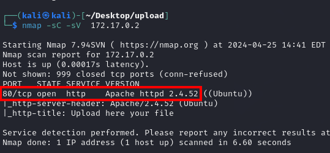
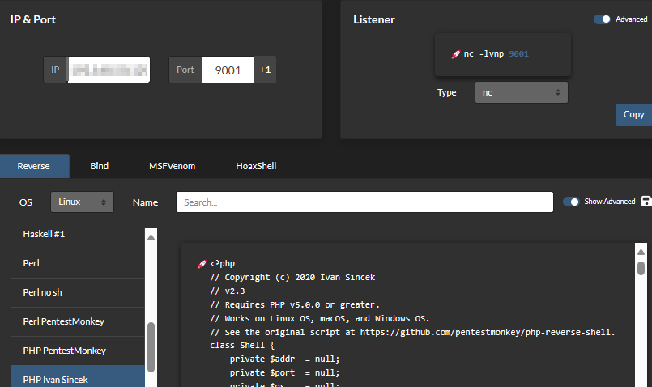

## Upload 

As always we start with the deployment of the machine and checking that we have connectivity to it with a simple ping. 

Next step will be the enumeration of services and ports, for this we will use nmap. 

The only port we see open is port 80 which is running an Apache http server. 
We are going to apply fuzzing on this one using gobuster. 

From the results, the two marked directories /uploads and /upload.php stand out, from the names we can already intuit what we can find./span> 

Let's try uploading a file and then accessing it. If files uploaded to the server are not properly validated, they could include malicious code or scripts that could be used to compromise the security of the server or other users accessing those files. By uploading executable files or scripts to the server, an attempt could be made to exploit remote code execution. Let's check if we can actually see what we upload and check if the characters are cleaned up in case an XSS is possible. 

It seems to be cleaning up the characters so an xss doesn't seem like an option. Let's then go with the first option when we are allowed to upload files which is to try to launch malicious php code. 
PHP (Hypertext Preprocessor) is a server-side scripting language widely used for web development. It integrates with HTML to generate dynamic content and interactive web pages.. 
Let's check if we are indeed able to execute php code. 

Once checked we are really close to overcoming the machine. 
let's create a php payload that allows us to set up a reverse shell. 

We can see how we are under the session of the user www-data. In this case, 
www-data
can execute the command
/usr/bin/env
with root privileges
without the need to enter a password. 
in other words, we can run
/bin/sh
with the root privileges inherited from sudo. 
And with this we have already solved the machinw. 

