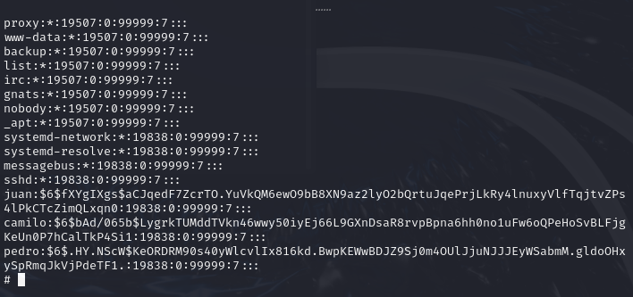

# Vacaciones

The first step will be to deploy the docker container and check if we can establish
connection by launching a ping to the machine.

Enumeration of ports and services using nmap 

Let's try to access the apache server and see what we find.
It seems to be empty, but inspecting the page we can see that we find a
user, actually 2, Camilo and Juan. 
Let's continue trying with directory enumeration using gobuster. 

We found that the javascript directory may be of interest but there's really nothing
that makes us think about exploiting the application from there.
Let's see if we are able to enumerate SSH users.

It seems to throw false positives and we cannot trust those values.
Let's try a dictionary attack for Camilo or Juan, with hydra we launch both. 
We found the password for camilo password1, now we can access via ssh.

Once in the ssh we notice that there is a third user named pedro and
that camilo cannot execute any command as sudo.
We remember that the server message said something about an important message so 

let's check messages and emails for more information.

Indeed, there was an important message such as the password of another user, let's 
try with Juan since he is the one who said he had an important message.
From Juan we can indeed execute commands as sudo, with this we can already exploit the 
machine and escalate privileges.
As a curiosity in the shadow file we see how there are more users and that pedro has 
an entry in the table with his password. 

Starting with $6$ we can guess that it is sha-512, a type of hash that is very resistant 
that would not be easy to break. 

