# GoogleCTF2018-Shall_We_Play_a_Game

Google CTF 2018 - Shallweplay Resolution

To solve this CTF, we'll follow the steps of our penetration testing methodology developed during my master's thesis. Firstly, we will install the application on the device and launch it to generate logs or other useful information.

Fortunately, it appears that there's no SSL pinning or root detection implemented, so we can skip those initial steps of our methodology.

The application seems to be a tic-tac-toe game, with a visible win counter.

To obtain the flag, it's likely that the application expects the player to win the game a certain number of times.

We use MobSF for an initial analysis of the application and proceed with static analysis.

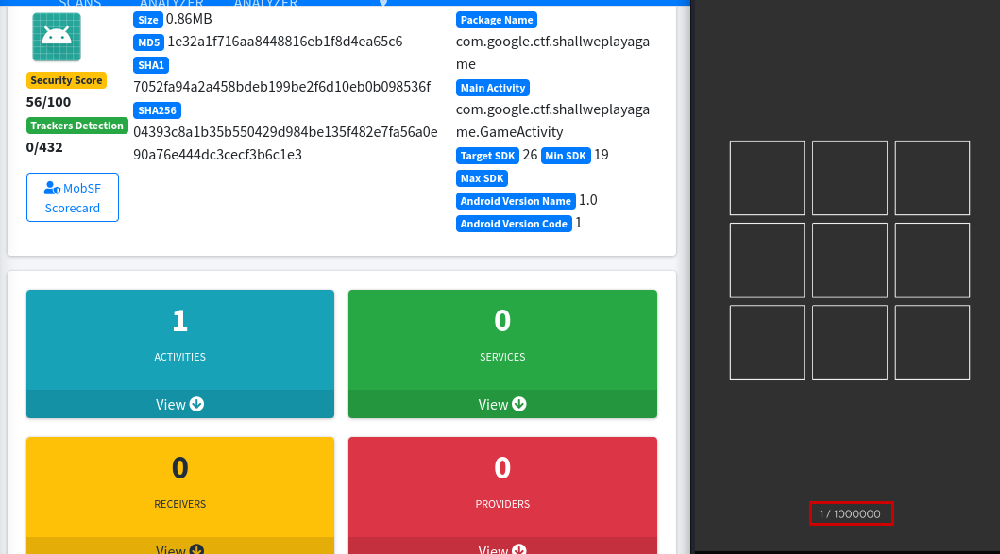

We extracted limited information from MobSF, indicating its compatibility with insecure Android versions. The application consists of a single activity, which we'll analyze statically.

The key insight we've gleaned is the existence of function "n".

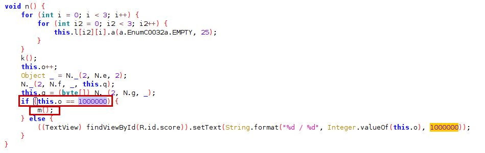

As observed, this function is triggered upon achieving a victory. Within this function, it verifies the number of victories (variable "o"), and upon reaching the specified threshold, function "m" is invoked.

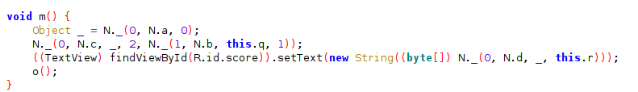

There are several techniques to bypass this check:

- Using Frida, modify the onCreate function so that it directly calls function "m" upon application launch.
- Modify the checks in the smali code and recompile the application to require a lower number of victories.
- Alter the conditions of the if statement, etc.

We'll use frida-ps to find the process related to the CTF.

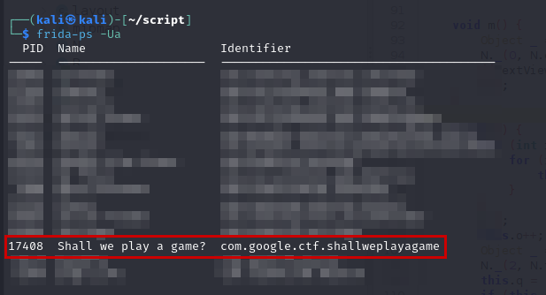

Once found, we create a small JavaScript script for Frida to see what happens if we directly call function "m" by overriding it.

Unfortunately, it seems that the flag is not displayed correctly. It's likely that we need to execute the loop multiple times to display the flag correctly. Let's try modifying the application again, this time to call function "m" the necessary number of times.

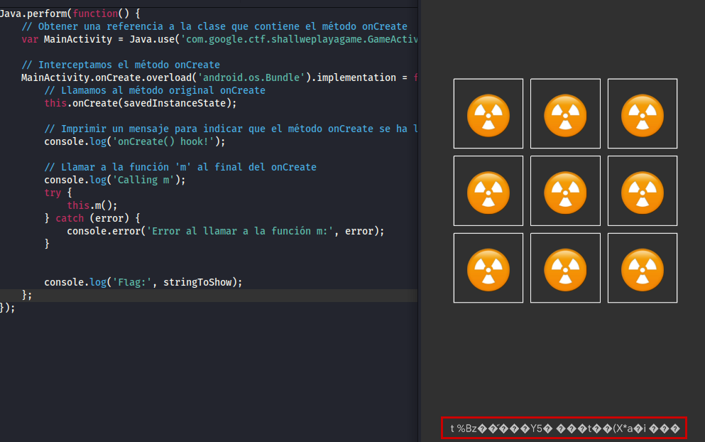

The initial solution would be to simply call the victory function the necessary number of times in a loop. Unfortunately, this approach results in a memory error.

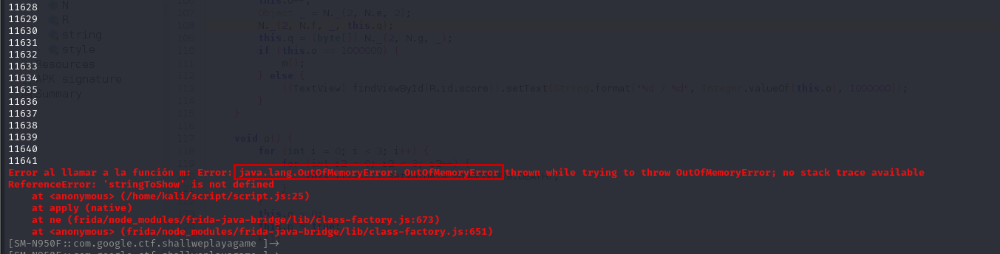

Let's try releasing resources every x iterations of the loop to see if we can achieve better results.

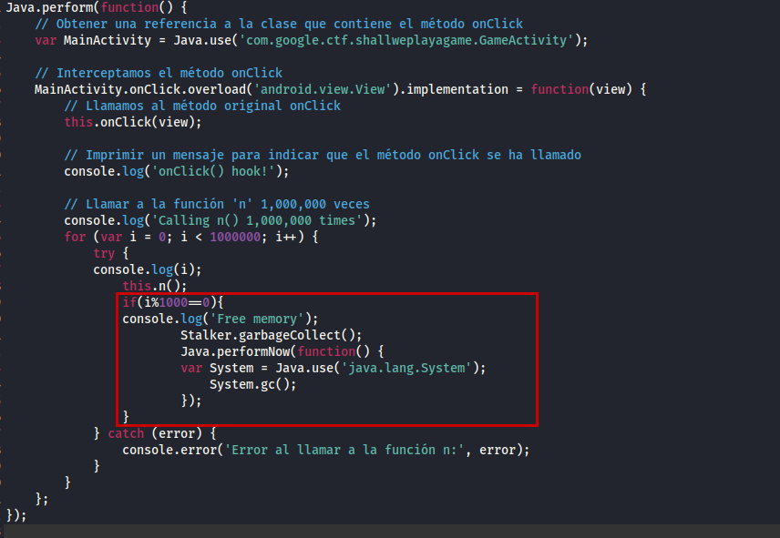

We encounter another error upon attempting this approach. It seems that there's little more we can do along this path, as the class "N" is loaded from native libraries, making it unfeasible to intercept and modify the flow with Frida. Let's delve deeper into analyzing the application.

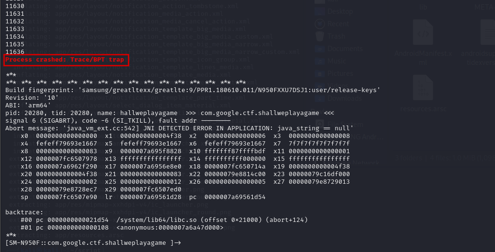

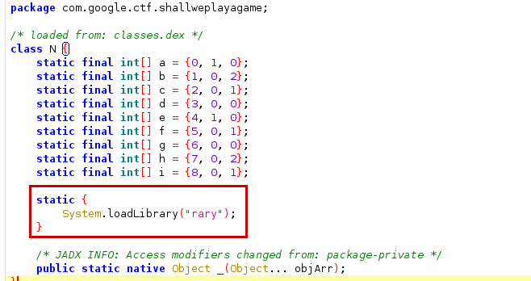

Therefore, let's attempt to modify the code at a lower level by acting on the smali code. To do this, we'll decompile the application using apktool and search in the smali code of the activity.

We'll search for the value of the check (1000000 in hexadecimal), and this way, we can locate the part of the loop that we're interested in iterating.

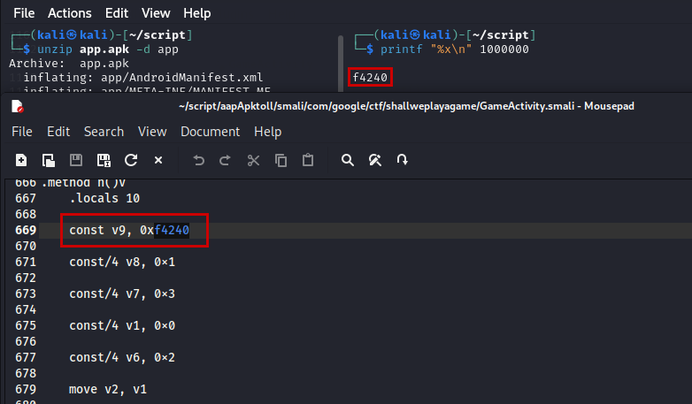

It's time to analyze the smali code to correlate it with the Java parts. We'll delve into the smali files to understand how they correspond to the Java code and identify the sections relevant to our objective.

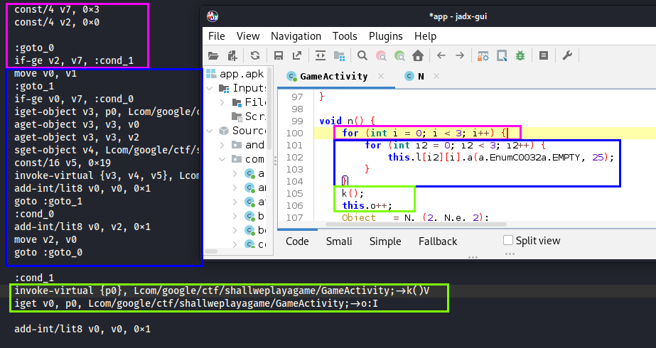

Based on this initial analysis, the section we need to repeat starts from "cond_1".

As a first idea, let's modify the condition part so that if the condition for obtaining the flag is not met, it returns to the beginning of the loop and repeats the process until we obtain the flag.

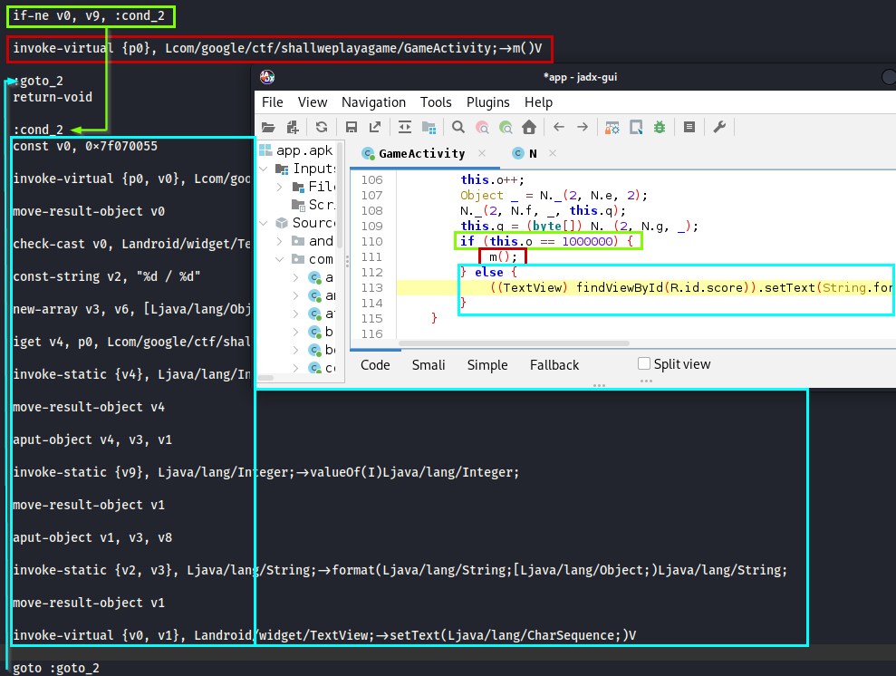

In other words, we'll simply change the instruction if-ne v0, v9, :cond_2 to if-ne v0, v9, :cond_1.
The last steps will bet recompile and sign the application.

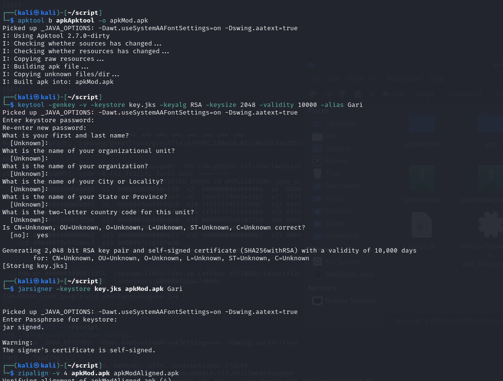

We run the application again, and this time we obtain the flag.

**CTF{ThLssOfInncncIsThPrcOfAppls}**

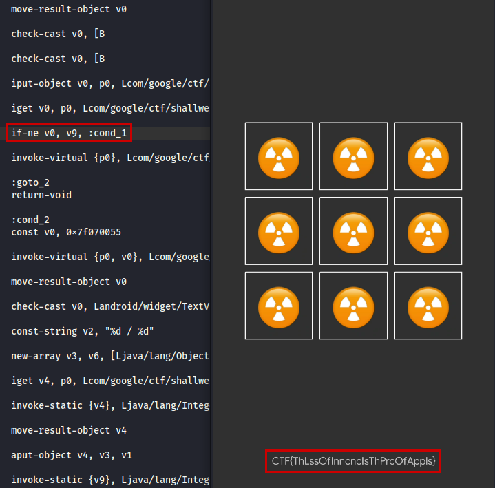

